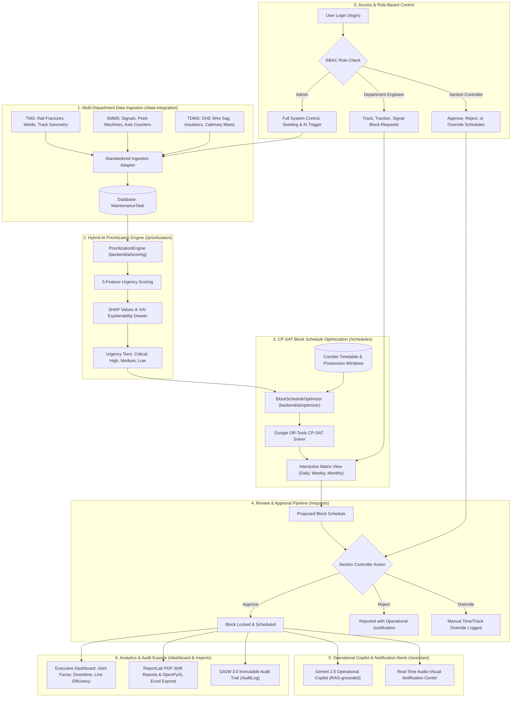

```mermaid
graph TB
    subgraph Frontend["Frontend Client (React 19 + Vite 8 + TailwindCSS + UX4G)"]
        UI_AUTH["Authentication & RBAC Context"]
        UI_DASH["Executive Operations Dashboard & KPIs"]
        UI_INT["TMS / SMMS / TDMS Data Ingestion & CSV Importer"]
        UI_AI["Explainable AI Prioritization & SHAP View"]
        UI_GANTT["FullCalendar Daily / Weekly / Monthly Matrix"]
        UI_REQ["Block Request & Approval Pipeline"]
        UI_MAP["Interactive 18-Zone Geographic Map (Leaflet)"]
        UI_ASST["Gemini AI Operational Assistant & Copilot"]
        UI_NOTIF["Real-Time Notification Center & Audio Alerts"]
        UI_REP["Section Availability, PDF Briefings & Excel Reports"]
    end

    subgraph Backend["Unified Backend & AI Engine (FastAPI + Python 3.10+)"]
        API_AUTH["JWT Auth & Role-Based Access Guard"]
        API_TASKS["Maintenance Task Management & Telemetry"]
        API_CORR["58 High-Density Corridors Across 18 Railway Zones"]
        API_SCHED["Schedule Optimizer & Approval Workflow"]
        API_INGEST["Multi-Source Ingestion & Adapters (data.gov.in)"]
        API_ASST["Gemini 2.5 AI Assistant with Dynamic RAG"]
        API_AUDIT["GIGW 3.0 Immutable Audit Trail"]
        AI_PRIO["PrioritizationEngine: XGBoost + Rules + SHAP"]
        AI_OPT["BlockScheduleOptimizer: Google OR-Tools CP-SAT"]
        AI_METRICS["Corridor Availability & Section Metrics"]
        API_REP["ReportLab PDF & Multi-Sheet Excel Generator"]
    end

    subgraph Storage["Storage Layer"]
        DB[("Managed PostgreSQL / SQLite Database")]
    end

    Frontend -->|"REST API / JWT Bearer"| Backend
    Backend --> DB
```

# 🚆 RailOpt AI — AI-Powered Automatic Block Planning System
### Indian Railways | Smart India Hackathon Prototype (PS-26027)

> **Version 2.0.0** — An intelligent, coordinated maintenance block scheduling system for Indian Railways covering **all 18 Zonal Railways (58 High-Density Corridors)**. Integrates multi-department defect pipelines (**Track/TMS**, **S&T/SMMS**, **TRD/TDMS**) with corridor availability data, using hybrid AI/ML prioritization (**XGBoost + Domain Rules + SHAP XAI**), **Google OR-Tools CP-SAT** constraint optimization to maximize corridor throughput, and an **LLM-powered Operational AI Assistant (Google Gemini 2.5)** with contextual RAG grounding.

---

## 🏛️ System Architecture

```
+-----------------------------------------------------------------------------------------+
|                  FRONTEND CLIENT (React 19 + Vite 8 + TailwindCSS + UX4G)               |
|                                                                                         |
|  [Auth & RBAC]         [Executive Dashboard]        [Data Ingestion (TMS/SMMS/TDMS)]    |
|  [AI Prioritizer & XAI] [Interactive Gantt Matrix]   [Block Request & Approval Workflow] |
|  [18-Zone GIS Map]     [Gemini AI Assistant & RAG]  [Notification Center & Audio Alerts]|
|  [PDF & Excel Reports] [Zonal Switcher & Filters]   [GIGW 3.0 / WCAG Accessibility]     |
+--------------------------------------------+--------------------------------------------+
                                             |
                                  REST API / JWT Bearer
                                     (Port 3000 -> 8000)
                                             |
                                             v
+-----------------------------------------------------------------------------------------+
|                    BACKEND API & AI ENGINE (FastAPI + Python 3.10+)                     |
|                                                                                         |
|  * API Routers: Auth, Tasks, Corridors, Schedules, Reports, Timetable, Alerts, Assistant|
|  * PrioritizationEngine: 5-Feature Hybrid Scorer (Safety, Overdue, Traffic, Recurrence) |
|  * BlockScheduleOptimizer: Google OR-Tools CP-SAT (Joint Multi-Dept Shadow Bundling)    |
|  * Assistant Engine: Google Gemini 2.5 RAG with live telemetry & corridor context       |
|  * Availability & Metrics: Dynamic Corridor Slot & Maintenance Tracking (58 Corridors)  |
|  * Data Ingestion Adapters: Standardized data.gov.in & department telemetry parsers     |
|  * Reporting Engine: ReportLab PDF Generation + OpenPyXL Multi-Sheet Excel Engine       |
+--------------------------------------------+--------------------------------------------+
                                             |
                                  SQLAlchemy ORM 2.0
                                             |
                                             v
+-----------------------------------------------------------------------------------------+
|                       DATABASE LAYER (PostgreSQL / SQLite)                              |
|  Users | MaintenanceTasks | BlockSchedules | Corridors | TrainTimetables | AuditLogs    |
+-----------------------------------------------------------------------------------------+
```



---

## 🔄 End-to-End Operational Workflow

```
[0. Login & RBAC]        --> Admin / Section Controller / Department Engineers (Track, TRD, Signal)
         |
         v
[1. Multi-Dept Ingestion]--> Ingest defects from TMS (Track), SMMS (Signals), TDMS (OHE) across 18 Zones
         |
         v
[2. AI Prioritization]   --> Hybrid Scorer: Safety (35%) + Overdue (25%) + Traffic (20%) + Recurrence (20%)
         |
         v
[3. CP-SAT Optimization] --> Google OR-Tools schedules non-overlapping, joint-bundled maintenance windows
         |
         v
[4. Approval & Override] --> Section Controller approves, rejects, or logs manual time/track overrides
         |
         v
[5. AI Copilot & Alerts] --> Gemini 2.5 operational queries, shift handovers, audio-visual notification alerts
         |
         v
[6. Analytics & Reports] --> Executive Dashboard KPIs, Availability %, GIGW 3.0 Audit Logs, PDF/Excel Exports
```



---

## 🌟 Core System Modules & Features

### 1. 🇮🇳 Pan-India 18-Zone & 58-Corridor Coverage
- Complete topological and corridor dataset modeling all **18 Indian Railway Zones**:
  - `NR` (Northern), `NCR` (North Central), `WR` (Western), `CR` (Central), `ER` (Eastern), `ECR` (East Central), `SER` (South Eastern), `SECR` (South East Central), `ECoR` (East Coast), `SR` (Southern), `SCR` (South Central), `SWR` (South Western), `NWR` (North Western), `NER` (North Eastern), `NFR` (Northeast Frontier), `WCR` (West Central), `METRO` (Kolkata Metro), `KRCL` (Konkan Railway).
- **Zonal Context Filtering**: Instant header dropdown switches corridor lists, defect pipelines, map overlays, schedules, and reports per zone.

### 2. 🎨 UX4G & GIGW 3.0 Compliant Interface
- Built with **UX4G (User Experience for Government)** design tokens:
  - Official Navy Blue (`#003366`), Saffron Accent (`#FF671F`), India Green (`#046A38`), Neutral Slate Canvas (`#F4F6F8`).
- **GIGW 3.0 Accessibility**:
  - High contrast ratios (>4.5:1), keyboard focus navigation, ARIA compliant attributes, and screen-reader friendliness.
  - Dedicated notification drawer with audio cues, badges, and quick dismiss/mark-as-read workflows.

### 3. 🤖 Google Gemini 2.5 Operational AI Assistant
- Live **Retrieval-Augmented Generation (RAG)** grounded on live system state:
  - Database tasks, active corridor maintenance blocks, zone-specific defects, and timetable clashes.
  - Multi-turn conversational interface with stream simulation, system status chips, and prompt recommendations.

### 4. 🧠 Explainable AI Prioritization (`PrioritizationEngine`)
- Hybrid 5-feature ML scoring model combining domain safety rules with **XGBoost classification**:
  - Factors: Criticality tier, days overdue, section traffic density (GMT), defect recurrence, and inspection gap.
- **SHAP (SHapley Additive exPlanations)** XAI side drawer providing exact mathematical feature contributions for every scored defect.

### 5. ⚡ CP-SAT Constraint Block Optimizer (`BlockScheduleOptimizer`)
- Powered by **Google OR-Tools CP-SAT Solver**:
  - Enforces hard non-overlapping track occupancy constraints against dynamic passenger/freight timetable windows.
  - **Joint Shadow Bundling**: Automatically groups Engineering, TRD, and S&T tasks in overlapping spatial windows to minimize corridor disruption.
  - Fallback heuristic scheduler for ultra-fast response under tight computational bounds.

### 6. 📊 Reports, Auditing & PDF Generation
- **ReportLab PDF Engine**: Shift handovers, daily maintenance briefings, and executive safety summaries.
- **OpenPyXL Multi-Sheet Excel Engine**: Comprehensive section downtime, joint factor metrics, and corridor availability statistics.
- **GIGW 3.0 Immutable Audit Trail**: Tracks all approvals, rejections, manual overrides, and schedule modifications with cryptographic user signatures.

---

## 🔑 Demo Credentials

| Role | Email | Password | Scope & Permissions |
| :--- | :--- | :--- | :--- |
| **Administrator** | `admin@railways.gov.in` | `RailAdmin@120` | Full administrative control, seeding, AI execution |
| **Section Controller** | `control@railways.gov.in` | `RailControl@120` | Approve, reject, override block requests |
| **Track Engineer (TMS)** | `engineering@railways.gov.in` | `RailEng@120` | Submit and track Civil/P-Way defect blocks |
| **Traction Engineer (TDMS)**| `trd@railways.gov.in` | `RailTrd@120` | Submit and track OHE/Electrical blocks |
| **Signal Engineer (SMMS)** | `signal@railways.gov.in` | `RailSt@120` | Submit and track S&T maintenance blocks |

*(Quick-login buttons on the `/login` page provide 1-click authentication with these credentials).*

---

## 🚀 Quick Start Guide (Local Development)

### Prerequisites
- **Node.js** (v18+) & **npm**
- **Python** (v3.10+)

---

### Step 1: Clone & Configure Environment
```bash
# Clone the repository
git clone https://github.com/subham120/RailOpt-AI.git
cd RailOpt-AI

# Copy environment template
cp .env.example .env
```

Edit `.env` and add your Google Gemini API key:
```env
GEMINI_API_KEY=your_gemini_api_key_from_google_ai_studio
```

---

### Step 2: Install Dependencies

```bash
# Install Python backend dependencies
pip install -r backend/requirements.txt

# Install React frontend dependencies
cd client
npm install
cd ..
```

---

### Step 3: Run the Application

Launch both the FastAPI backend and Vite frontend with a single command:

```bash
npm run dev
```

Or run them individually in separate terminals:
```bash
# Terminal 1: Backend API & AI Engine (Port 8000)
cd backend
python -m uvicorn main:app --reload --host 0.0.0.0 --port 8000

# Terminal 2: React Frontend (Port 3000)
cd client
npm run dev
```

* **Frontend UI**: `http://localhost:3000`
* **FastAPI Swagger API Docs**: `http://localhost:8000/docs`
* **Health Endpoint**: `http://localhost:8000/api/health`

---

### Step 4: Run Automated Tests

Run the full automated pytest suite (26 passing tests covering API endpoints, auth security, data adapters, CP-SAT optimizer, AI prioritizer, availability metrics, and assistant RAG):

```bash
python -m pytest tests -v
```

---

## ☁️ Deployment Guide

RailOpt AI is production-ready for deployment on **Render**, **Railway**, or any standard **Linux/VPS Server**.

### Option A: Render.com (1-Click Blueprint)

The repository includes a ready-to-use [`render.yaml`](./render.yaml) Infrastructure-as-Code blueprint.

1. Go to [render.com](https://render.com) → Click **"New +"** → **"Blueprint"**.
2. Connect your GitHub repository (`subham120/RailOpt-AI`).
3. Set your `GEMINI_API_KEY` when prompted.
4. Click **"Apply"** — Render automatically provisions:
   - `railopt-api` (FastAPI Python backend)
   - `railopt-frontend` (React static site)
   - `railopt-postgres` (Managed PostgreSQL database)

---

### Option B: Railway.app

1. Create a project on [railway.app](https://railway.app) from your GitHub repo.
2. Add a **PostgreSQL** database addon (auto-binds `DATABASE_URL`).
3. Set the backend service build command to `pip install -r backend/requirements.txt` and start command to `uvicorn backend.main:app --host 0.0.0.0 --port $PORT`.
4. Add the frontend service pointing to `client/` directory with `npm run build`.

---

### Option C: Ubuntu / VPS / Dedicated Server

Refer to our comprehensive [Deployment Guide](./deployment_guide.md) for full Nginx, Gunicorn/Uvicorn systemd services, Let's Encrypt SSL, and PostgreSQL configuration instructions.

---

## 📂 Project Structure

```
RailOpt-AI/
├── .agents/                    # Custom agent rules & engineering standards
├── backend/                    # FastAPI Backend & AI Engines
│   ├── ai/
│   │   ├── metrics/            # Line availability & section utilization metrics
│   │   ├── optimizer/          # Google OR-Tools CP-SAT scheduler
│   │   └── scoring/            # XGBoost + SHAP feature scoring engine
│   ├── api/                    # REST API Routers (auth, tasks, corridors, assistant...)
│   ├── core/                   # Security, config, dependency injection
│   ├── data/                   # data.gov.in datasets & block requests CSVs
│   ├── db/                     # SQLAlchemy engine, session maker & Base
│   ├── ingest/                 # TMS, SMMS, TDMS telemetry adapters
│   ├── models/                 # SQLAlchemy DB models (User, Task, Corridor...)
│   ├── seed/                   # 18-zone seed data & generator scripts
│   └── main.py                 # FastAPI application entry point
├── client/                     # React 19 + Vite 8 SPA
│   ├── src/
│   │   ├── components/         # Layout, Header, Sidebar, Notifications, Maps
│   │   ├── context/            # AuthContext & global state
│   │   ├── pages/              # Dashboard, Prioritization, Schedules, Assistant...
│   │   ├── services/           # Axios API client
│   │   └── utils/              # Zonal constants, helpers, formatters
│   └── vite.config.js          # Vite config with API proxy
├── tests/                      # 26 automated pytest suites
├── .env.example                # Documented production environment template
├── render.yaml                 # Render cloud deployment blueprint
├── package.json                # Root concurrently runner
└── README.md                   # System documentation
```

---

## 🛡️ License & Acknowledgements

Developed for the **Smart India Hackathon (SIH 2026)** under Problem Statement **PS-26027** (*AI-Powered Automatic Block Planning for Indian Railways*).

Distributed under the **MIT License**.
