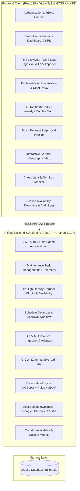
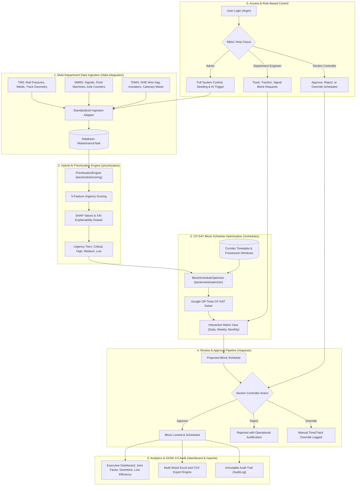

# 🚆 RailOpt AI — AI-Powered Automatic Block Planning System
### Indian Railways | Smart India Hackathon Prototype (PS-26027)

> An intelligent, coordinated maintenance block scheduling system for Indian Railways that integrates multi-department defect pipelines (Track/TMS, S&T/SMMS, TRD/TDMS) with corridor availability data, using hybrid AI/ML prioritization (XGBoost + Domain Rules + SHAP XAI) and Google OR-Tools CP-SAT constraint optimization to maximize corridor availability and minimize train disruption.

---

## 🏛️ System Architecture

```
+-------------------------------------------------------------------------------+
|               FRONTEND CLIENT (React 18 + Vite + TailwindCSS + UX4G)          |
|                                                                               |
|  [Auth & RBAC]     [Dashboard & KPIs]     [Data Ingestion (TMS/SMMS/TDMS)]    |
|  [AI Scorer & XAI] [Gantt Matrix View]    [Block Requests & Approval Queue]   |
|  [Geographic Map]  [AI Copilot & Alerts]  [Availability & Excel Reports]      |
+---------------------------------------+---------------------------------------+
                                        |
                             REST API / JWT Bearer
                                (Port 3000 -> 8000)
                                        |
                                        v
+-------------------------------------------------------------------------------+
|               BACKEND API & AI ENGINE (FastAPI + Python 3.10+)                |
|                                                                               |
|  * API Routers: Auth, Tasks, Corridors, Schedules, Reports, Timetable, Alerts |
|  * PrioritizationEngine: 5-Feature Hybrid Model (Safety, Overdue, Traffic...)  |
|  * BlockScheduleOptimizer: Google OR-Tools CP-SAT (Joint Shadow Bundling)    |
|  * Availability & Metrics: Dynamic Corridor Slot & Maintenance Tracking       |
+---------------------------------------+---------------------------------------+
                                        |
                               SQLAlchemy / SQLite
                                        |
                                        v
+-------------------------------------------------------------------------------+
|                      DATABASE LAYER (railopt.db)                              |
|  Users | MaintenanceTasks | BlockSchedules | Corridors | Timetable | Audits  |
+-------------------------------------------------------------------------------+
```



---

## 🔄 End-to-End Operational Workflow

```
[0. Login & RBAC] --> Admin / Section Controller / Department Engineers (Track, TRD, Signal)
        |
        v
[1. Multi-Dept Ingestion] --> Ingest defects from TMS (Track), SMMS (Signals), TDMS (OHE)
        |
        v
[2. AI Prioritization]    --> Hybrid Scorer: Safety (35%) + Overdue (25%) + Traffic (20%) + Recurrence (20%)
        |
        v
[3. CP-SAT Optimization]  --> Google OR-Tools schedules non-overlapping, joint-bundled maintenance windows
        |
        v
[4. Approval & Override]  --> Section Controller approves, rejects, or logs manual time/track overrides
        |
        v
[5. Analytics & Auditing] --> Executive Dashboard KPIs, Availability %, GIGW 3.0 Audit Logs, Excel (.xlsx) Exports
```



---

## 🌟 Core System Modules

### 1. UX4G & GIGW 3.0 Compliant Interface
- Built with **UX4G (User Experience for Government)** design tokens:
  - Official Navy Blue (`#003366`), Saffron Accent (`#FF671F`), India Green (`#046A38`), Neutral Canvas (`#F4F6F8`).
- GIGW 3.0 Accessibility:
  - Accessible contrast ratios (>4.5:1), keyboard focus indicators, and ARIA labels.
  - Role-specific navigation, interactive breadcrumbs, and Sonner toast alerts.

### 2. Multi-Department Telemetry Ingestion
- Real-world CSV import adapters and mock generators:
  - **TMS (Track Management System)**: P-Way rail fractures, track geometry, turnouts.
  - **SMMS (Signalling Maintenance & Management System)**: Signals, points, track circuits, interlocking.
  - **TDMS (Traction Distribution Management System)**: OHE wire sags, insulators, pantograph clearances.
- Real dynamic timetable conflict checking (`TrainTimetable`).

### 3. Explainable AI Prioritization (`PrioritizationEngine`)
- Hybrid 5-feature model combining domain expert safety rules with XGBoost classification.
- Transparent **SHAP (SHapley Additive exPlanations)** score breakdowns explaining why a defect is classified as `Critical`, `High`, `Medium`, or `Low`.

### 4. Constraint-Satisfaction Optimization (`BlockScheduleOptimizer`)
- **Google OR-Tools CP-SAT Solver**:
  - Non-overlapping track occupancy constraints.
  - Shadow block bundling: groups Engineering, TRD, and S&T tasks in the same corridor window to reduce train downtime.
  - Fallback heuristic scheduler for ultra-fast response under tight computational bounds.

### 5. Corridor Availability & Analytics
- Live availability computation across 12 Northern Railway corridor sections (e.g. `ALD-MGS`, `NDLS-GZB`, `CNB-PRYJ`, `DLI-UMB`).
- Multi-sheet Excel export for divisional railway controllers.

---

## 🔑 Demo Credentials

| Role | Email | Password | Scope & Permissions |
| :--- | :--- | :--- | :--- |
| **Administrator** | `admin@railways.gov.in` | `admin123` | Full administrative control, seeding, AI execution |
| **Section Controller** | `control@railways.gov.in` | `control123` | Approve, reject, override block requests |
| **Track Engineer (TMS)** | `engineering@railways.gov.in` | `eng123` | Submit and track Civil/P-Way defect blocks |
| **Traction Engineer (TDMS)**| `trd@railways.gov.in` | `trd123` | Submit and track OHE/Electrical blocks |
| **Signal Engineer (SMMS)** | `signal@railways.gov.in` | `sig123` | Submit and track S&T maintenance blocks |

---

## 🚀 Quick Start Guide

### Prerequisites
- **Node.js** (v18+)
- **Python** (v3.10+)

---

### Step 1: Clone & Configure Environment
```bash
# Clone the repository
git clone https://github.com/subham120/RailOpt-AI.git
cd RailOpt-AI

# Copy environment template
cp .env.example .env
```

---

### Step 2: Install Dependencies

```bash
# Install Python backend dependencies
pip install -r backend/requirements.txt

# Install React frontend dependencies
cd client
npm install
cd ..
```

---

### Step 3: Run the Full Application

You can launch both the FastAPI backend and Vite frontend with a single command from the root directory:

```bash
npm run dev
```

Or run them individually:
```bash
# Terminal 1: Backend API & AI Engine (Port 8000)
cd backend
python -m uvicorn main:app --reload --host 0.0.0.0 --port 8000

# Terminal 2: React Frontend (Port 3000)
cd client
npm run dev
```

* **Frontend UI**: `http://localhost:3000`
* **FastAPI Swagger Docs**: `http://localhost:8000/docs`

---

### Step 4: Run Automated Tests

The test suite validates data ingestion adapters, auth security, availability metrics, CP-SAT optimizer, and AI prioritizer:

```bash
python -m pytest tests
```

---

## 🛡️ License
Developed for Indian Railways Smart India Hackathon (SIH 2026). Distributed under the MIT License.
