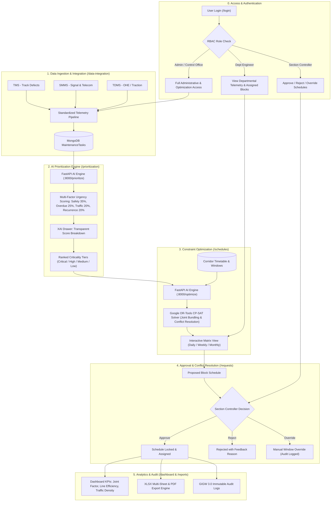

# 🚆 AI-Powered Automatic Block Planning System — Indian Railways

> An intelligent, coordinated maintenance block scheduling system for Indian Railways that integrates multi-department defect pipelines (Engineering, TRD, S&T) with corridor availability data, using hybrid AI/ML prioritization and OR-Tools CP-SAT constraint optimization to maximize asset availability and minimize train disruption.

---

## 🏛️ System Architecture

```mermaid
graph TB
    subgraph Frontend["Frontend Client (React + Vite + Tailwind CSS + UX4G)"]
        UI_AUTH[Authentication & RBAC]
        UI_DASH[Executive Dashboard & KPIs]
        UI_INT[TMS / SMMS / TDMS Ingestion Table]
        UI_AI[AI Prioritization & Explainability]
        UI_GANTT[FullCalendar Weekly & Monthly Gantt]
        UI_REQ[Block Request & Approval Queue]
        UI_REP[Downtime, Utilization & Audit Trail]
    end

    subgraph Backend["Backend API (Node.js + Express)"]
        API_AUTH[JWT Auth & Role Guard]
        API_TASK[Maintenance Task CRUD & Ingestion]
        API_CORR[Corridor & Traffic Management]
        API_SCHED[Schedule Management & Approval Pipeline]
        API_AUDIT[Audit Log & Override Tracker]
        API_PROXY[AI Microservice Proxy]
    end

    subgraph AI["AI/ML Optimization Engine (Python FastAPI)"]
        AI_PRIO[Hybrid Criticality Scorer (XGBoost + Domain Rules)]
        AI_OPT[CP-SAT Constraint Solver (OR-Tools)]
        AI_MOCK[Synthetic Defect & Corridor Generator]
    end

    subgraph Storage["Databases"]
        MONGO[(MongoDB: Users, Tasks, Schedules, Audit Logs)]
        PG[(PostgreSQL: Corridors, Block Windows, Traffic Timeseries)]
    end

    Frontend -->|REST API / JWT| Backend
    Backend -->|JSON RPC| AI
    Backend --> MONGO
    Backend --> PG
```

---

## 🔄 End-to-End Application Flow



---

## 🌟 Key Features

### 1. UX4G & GIGW Compliant Interface
- Built adhering to **UX4G Design System (NeGD / MeitY)** tokens:
  - Official Navy Blue (`#003366`), Saffron (`#FF671F`), Green (`#046A38`), Neutral (`#F4F6F8`).
- GIGW 3.0 Accessibility features:
  - **Skip to Main Content** shortcut.
  - **Font Size Switcher** (`A-`, `A`, `A+`).
  - High-contrast visual cues and WCAG 2.1 AA accessible focus rings.

### 2. Multi-Department Data Ingestion
- Ingests and normalizes maintenance records across 3 key railway systems:
  - **TMS (Track Management System)**: Rail fractures, weld failures, track geometry defects, sleeper renewal.
  - **SMMS (Signalling Maintenance & Management System)**: Signal lamp failures, point machines, track circuits, axle counters.
  - **TDMS (Traction Distribution Management System)**: OHE wire sags, insulator flashovers, catenary mast damage, power interruptions.
- Simulates realistic Control Office Application (**COA**) block windows and train timetable overlays.

### 3. Explainable Hybrid AI Prioritization
- **60% Domain Rules + 40% XGBoost ML Classifier**:
  - **Safety Risk (35%)**: Derailment and signal failure hazard grading.
  - **Overdue Factor (25%)**: Exponential urgency penalty for past-due maintenance.
  - **Corridor Traffic Density (20%)**: Higher weight for high-density golden quadrilateral sections (e.g., NDLS-GZB).
  - **Recurrence Frequency (20%)**: Identifies recurring asset degradation spots.
- **Explainability Panel**: Transparent breakdown of why each task is classified as `Critical`, `High`, `Medium`, or `Low`.

### 4. Constraint-Based Block Schedule Optimizer (OR-Tools CP-SAT)
- Solves complex track possession scheduling:
  - **Non-overlapping constraints** on identical section tracks.
  - **Available possession window constraints** (e.g. night maintenance slots 00:30–04:30).
  - **Multi-department coordination bonus**: Combines Engineering, TRD, and S&T blocks in the same section/window to minimize total possession hours.
  - **Fallback greedy heuristic scheduler** if CP-SAT solver encounters timeouts or resource constraints.

### 5. Interactive Gantt Timeline & Multi-Horizon Views
- **Weekly & Monthly Gantt Visualizer** via FullCalendar.
- Distinct color-coded representations for Engineering, TRD, Signal, and Multi-department combined blocks.
- One-click Excel spreadsheet export for divisional traffic controllers.

### 6. Role-Based Access Control (RBAC) & Transparent Audit Log
- Custom role experiences for:
  - **Admin**: Full system control, seeding, configuration.
  - **Department Engineers (Engineering / TRD / S&T)**: Raise block requests, monitor department-specific tasks.
  - **Control Office Viewer / Section Controller**: Review, approve, reject, or manually override schedules with mandatory reasoning audit logs.

---

## 🔑 Demo Login Credentials

| Role | Email | Password | Primary Permissions |
| :--- | :--- | :--- | :--- |
| **Administrator** | `admin@railways.gov.in` | `admin123` | Full access, mock seeding, AI trigger |
| **Engineering (P.Way)** | `engineering@railways.gov.in` | `eng123` | Raise requests, view P.Way tasks |
| **Traction (TRD)** | `trd@railways.gov.in` | `trd123` | Raise requests, view OHE tasks |
| **Signal & Telecom (S&T)** | `signal@railways.gov.in` | `sig123` | Raise requests, view Signal tasks |
| **Control Office** | `control@railways.gov.in` | `control123` | Approve, reject, override block schedules |

---

## 🚀 Quick Start Guide

### Prerequisites
- **Node.js** (v18+)
- **Python** (v3.10+)
- **MongoDB** (running on localhost:27017 or Atlas connection string)
- **PostgreSQL** (running on localhost:5432)

---

### Step 1: Environment Setup
Clone the repository and verify the root `.env` configuration:
```bash
# In the repository root
cp .env.example .env
```

Default configuration in `.env`:
```ini
MONGO_URI=mongodb://localhost:27017/sih_block_planning
PG_HOST=localhost
PG_PORT=5432
PG_DATABASE=sih_corridor_data
PG_USER=postgres
PG_PASSWORD=postgres
JWT_SECRET=sih-block-planning-secret-key-dev-2024
PORT=5000
AI_ENGINE_URL=http://localhost:8000
```

---

### Step 2: Backend & Database Seeding
```bash
# Navigate to server directory
cd server

# Install dependencies
npm install

# Seed initial users (Admin, Department Officers, Control Office)
npm run seed

# Start the Express server
npm run dev
```
*Server will start at `http://localhost:5000`*

---

### Step 3: Start the AI Optimization Microservice
```bash
# Navigate to ai-engine directory
cd ai-engine

# Create & activate virtual environment (optional but recommended)
python -m venv venv
# On Windows:
.\venv\Scripts\activate
# On Linux/macOS:
source venv/bin/activate

# Install dependencies
pip install -r requirements.txt

# Start FastAPI server
uvicorn main:app --reload --port 8000
```
*AI Engine will be accessible at `http://localhost:8000` (Swagger docs at `http://localhost:8000/docs`)*

---

### Step 4: Start the Frontend Client
```bash
# Navigate to client directory
cd client

# Install dependencies
npm install

# Start Vite dev server
npm run dev
```
*Frontend will launch at `http://localhost:3000`*

---

## 🔄 End-to-End Workflow Demonstration

1. **Sign In**: Login as `admin@railways.gov.in` (`admin123`) or use the quick login buttons on the login card.
2. **Data Ingestion**:
   - Navigate to **Data Integration**.
   - Click **"🌱 Seed Mock Data"** to populate 80+ realistic defects across 12 railway sections.
   - Or click **"+ TMS"**, **"+ SMMS"**, **"+ TDMS"** to simulate live streaming telemetry.
3. **AI Prioritization**:
   - Navigate to **AI Prioritization**.
   - Click **"🤖 Run AI Prioritization"** to execute XGBoost + Rule-based scoring.
   - Click any task row to expand the **Explainability breakdown** showing Safety, Overdue, Traffic, and Recurrence subscores.
4. **Schedule Generation & Gantt View**:
   - Navigate to **Block Schedules**.
   - Click **"⚡ Generate Optimal Schedule"**.
   - Inspect the interactive Gantt chart. Purple cards indicate **coordinated multi-department blocks** sharing possession windows.
   - Click on any block to inspect details, AI reasoning, and approval controls.
5. **Approval Workflow & Manual Override**:
   - Navigate to **Block Requests**.
   - Department users can raise new maintenance requests.
   - Control Office officers can approve or reject pending blocks.
6. **Reports & Audit Trail**:
   - Navigate to **Reports & Audit**.
   - Inspect Section Availability %, Downtime bar charts, Department utilization metrics, and the complete audit trail.
   - Export reports directly to Excel via the **"📥 Export"** buttons.

---

## 🛡️ License
Developed for Indian Railways Smart India Hackathon (SIH). Distributed under the MIT License.
